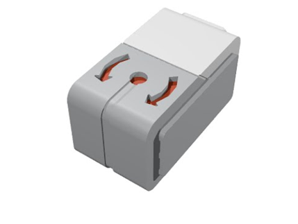
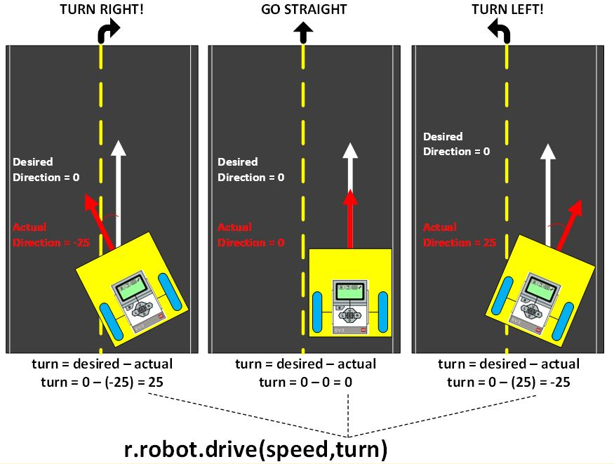

# Usign the Gyro

The Ev3 Gyro sensor shown below can be connected to any of the four sensor ports numbered 1-4 and used to determine the robots direction.
<p align="center">

 </p>
The Gyro provides the Ev3 with a sense of direction by indicating degrees of rotation since the gyro was last reset.  For example, if the robot has turned left and is now facing backwards the gyro would give a reading of -180.  If the robot has turned a quarter circle to the right the gyro would give a reading of 90.
<p align="center">

</p>
The Gyro can be used in a feedback loop to help the robot drive in a straight line.  A feedback loop can be created by first determining the error which is the difference between the direction the robot should be driving and the direction the robot is actually driving.  
<p align="center">

</p>
The error can then be used to continually sense and correct the robots direction by using the robot.drive(speed,turn) method inside of a while loop like shown below.  This example is intended to be included inside of a user defined robot class.  

If you are using the Bolton Robotics Base Code https://github.com/fssfll/fll_basecode, the code below would need to be added near the bottom of the [https://github.com/fssfll/fll_basecode/bolton_robotics_robot.py](https://github.com/fssfll/fll_basecode/blob/main/bolton_robotics_robot.py) file below the banner, "Define functions as needed." 

```python
  ################################
  # Define functions as needed
  ################################
  # gyro drive straight
    def gyro_drive_straight(self,speed, distance):
        ''' Drive straight using the gyro.
            Use a proportional feedback loop.
        '''
        # Reset the distance to 0.
        self.robot.reset()

        # Define the feedback loop gain value, "pd."  This determines how much the robot
        # will correct when it drives off course.  
        # This value may need to be adjusted.  Here are some tips:
        # 1) If the value is too large, the robot will over-correct for errors and snake back and forth.  
        # 2) If the value is too small, the robot will not correct enough and will go off course.
        # 3) If the robot spins in circles, try making this value negative (pd=-1)
        pd = 1

        # Get the current gyro angle.  This is the direction the robot should keep driving. 
        starting_angle = self.gyro_sensor.angle()
       
        # Create a while loop so the robot will drive until it reaches the target distance.  Inside the loop
        # the robot's current direction, "self.gyro_sensor.angle()" is repeatedly checked to see if it has gone off course. 
        # If needed, a course correction is made to turn back to the desired direction (starting_angle)
        while self.robot.distance() <= distance:
            # Calculate the error (the difference) between where the robot should be pointed and where it is pointed
            # Where the robot should be pointed:     starting_angle
            # Where the robot is currently pointed:  self.gyro_sensor.angle()
            direction_error = starting_angle - self.gyro_sensor.angle()

            # Use the feedback loop gain value, "pd" multiplied by the, "direction_error" to make the robot turn back
            # on course.
            turn = direction_error * pd

            # The robot should drive with the speed passed into this method, "gyro_drive_straight" and turn based on
            # the correction needed to keep going straight.
            self.robot.drive(speed,turn)
```

In addition to creating the gyro_drive_straight method, the Gyro must be reset and calibrated.  This can be accomplished with a calibrate_gyro method also added to the bottom of the [https://github.com/fssfll/fll_basecode/bolton_robotics_robot.py](https://github.com/fssfll/fll_basecode/blob/main/bolton_robotics_robot.py) file:
```python
# Reset The Gyro
    def calibrate_gyro(self, port_number):
        retry = 1
        while retry == 1:
            print("calibrating the Gyro")
            self.ev3.screen.draw_text(0, 0, "Reset Gyro")
            self.ev3.screen.draw_text(0, 22, "DO NOT MOVE!")
            if port_number == 1:
                analog_sensor = AnalogSensor(Port.S1)
                wait(1000)
                gyro_sensor = GyroSensor(Port.S1)
                wait(1000)
            elif port_number == 2:
                analog_sensor = AnalogSensor(Port.S2)
                wait(1000)
                gyro_sensor = GyroSensor(Port.S2)
                wait(1000)
            elif port_number == 3:
                analog_sensor = AnalogSensor(Port.S3)
                wait(1000)
                gyro_sensor = GyroSensor(Port.S3)
                wait(1000)
            else:
                analog_sensor = AnalogSensor(Port.S4)
                wait(1000)
                gyro_sensor = GyroSensor(Port.S4)
                wait(1000)
            i = 0
            while i <= 10:
                self.ev3.screen.clear()
                self.ev3.screen.draw_text(0, 0, "RESET GYRO")
                self.ev3.screen.draw_text(0, 22, "DO NOT MOVE!")
                self.ev3.screen.draw_text(0, 44, "Gyro= " + str(gyro_sensor.angle()))
                wait(100)
                self.ev3.screen.clear()
                i = i + 1
            if gyro_sensor.angle() == 0:
                retry = 0
                self.ev3.screen.clear()
                self.ev3.screen.draw_text(0, 44, "Gyro")
                self.ev3.screen.draw_text(0, 44, "Calibration")
                self.ev3.screen.draw_text(0, 84, "Complete")
                wait(500)
                self.ev3.screen.clear()
```
The calibrate_gyro method should be called only once on startup.  It is important to not move the robot when calibration is active.  The calibrate_gyro method can be called in [https://github.com/fssfll/fll_basecode/main.py](https://github.com/fssfll/fll_basecode/blob/main/main.py)
```python
###########
# Startup
###########
# Instantiate the Robot (use your robot class name!)
r = bolton_robotics_robot()

# Calibrate/Reset the Gyro to prevent drift
# The gyro's port number is passed into the method.  
# In this example, the gyro is wired to EV3 port 4.
# COMMENT OUT TO SPEED UP TESTING!
r.calibrate_gyro(4)

# Program select menu
menu(r)
```


The method can then be used inside of a mission program like in this example which is modified from [https://github.com/fssfll/fll_basecode/mission_three.py](https://github.com/fssfll/fll_basecode/blob/main/mission_three.py):
```python
##########################################################
# Pybrcks Micropython Base Code For Lego Mindstorm EV3 
# Created in Partnership: FLL Team 18300 & Bolton Robotics
#
# This code is free for all to use and modify in the spirit 
# of co-opertition.  Please consider giving a shout-out to
# Bolton Robotics and FLL Team 18300 if you find it helpful.
#
##########################################################
# mission_three.py
##########################################################

import math
import time
from pybricks.ev3devices import *
from pybricks.parameters import *
from pybricks.robotics import *
from pybricks.iodevices import *
from pybricks.tools import wait
from pybricks.hubs import EV3Brick
from bolton_robotics_robot import bolton_robotics_robot

def mission_three(r):
    r.ev3.screen.clear()
    print("Running Mission 3")
    r.ev3.screen.draw_text(30, 60, "Mission 3")
    wait(100)
    # Add your code below:
    # Drive straight using the gyro with speed 100 for 3000mm
    r.gyro_drive_straight(100,3000)
```
