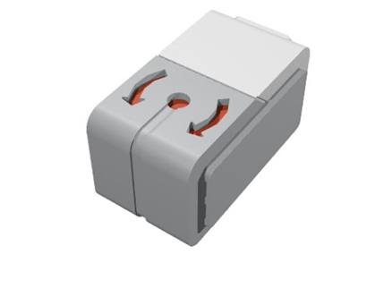

## Additional Advanced Training 
While students are not required to complete these training modules, they provide additional background on how the EV3 works and advanced techniques which may help to more reliably solve missions.

<TABLE>
<TR><TD> <A HREF="../calibration/calibration">Color Sensor Calibration</A> </TD><TD><B>Calibrating the color sensor is important before attempting to line follow.  Learn how to calibrate the color sensor with python.</B>
</TD>
</TR>
<TR><TD> <A HREF="../gyro/gyro">Using the Gyro</A> </TD><TD><B>A gyro can be useful to help the robot drive in a straight line or turn with greater precision.  Learn how to initialize and use the gyro.</B>
</TD>
</TR>
</TR>
<TR><TD> <A HREF="../rename/rename">Rename Your EV3</A> </TD><TD><B>Learn how to give your EV3 a new name</B>
</TD>
</TR>
</TABLE>
