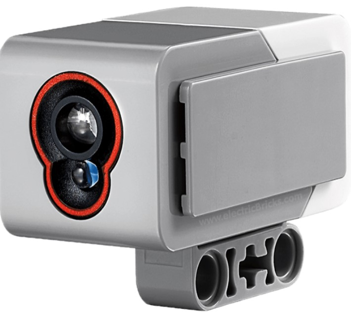

## Additional Advanced Training 
While students are not required to complete these training modules, they provide additional background on how the Spike robot works and advanced techniques which may help to more reliably solve missions.

<TABLE>
<TR><TD> <A HREF="../../calibration/calibration">Color Sensor Calibration</A> </TD><TD><B>Calibrating the color sensor is important before attempting to line follow.  Learn how to calibrate the color sensor with python.</B>
</TD>
</TR>
</TABLE>
