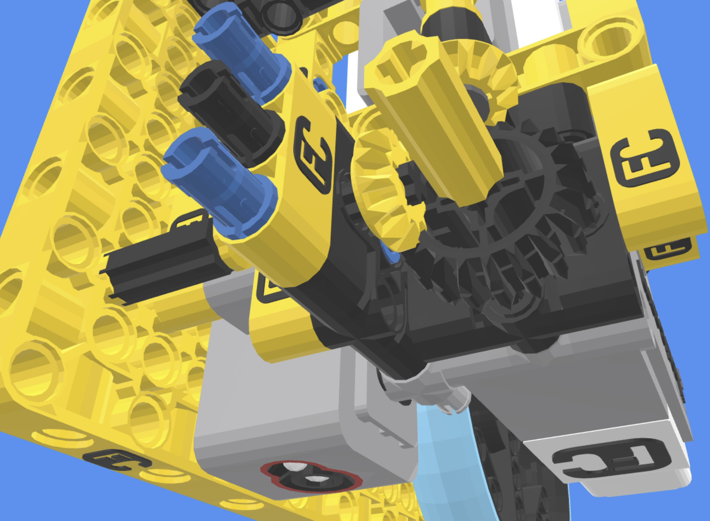
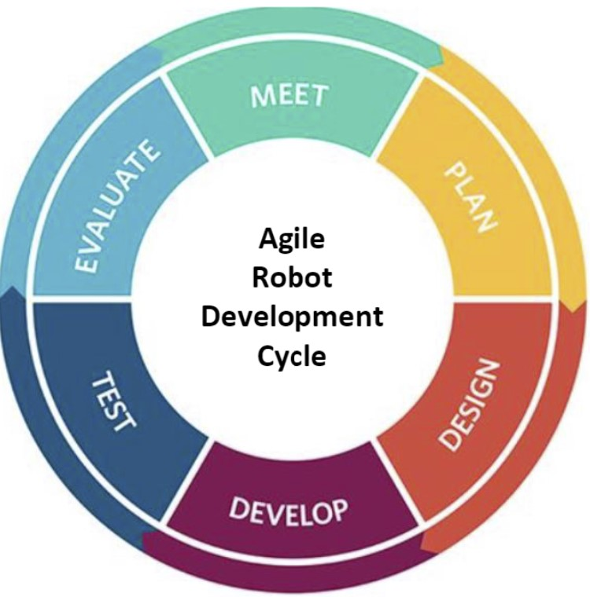
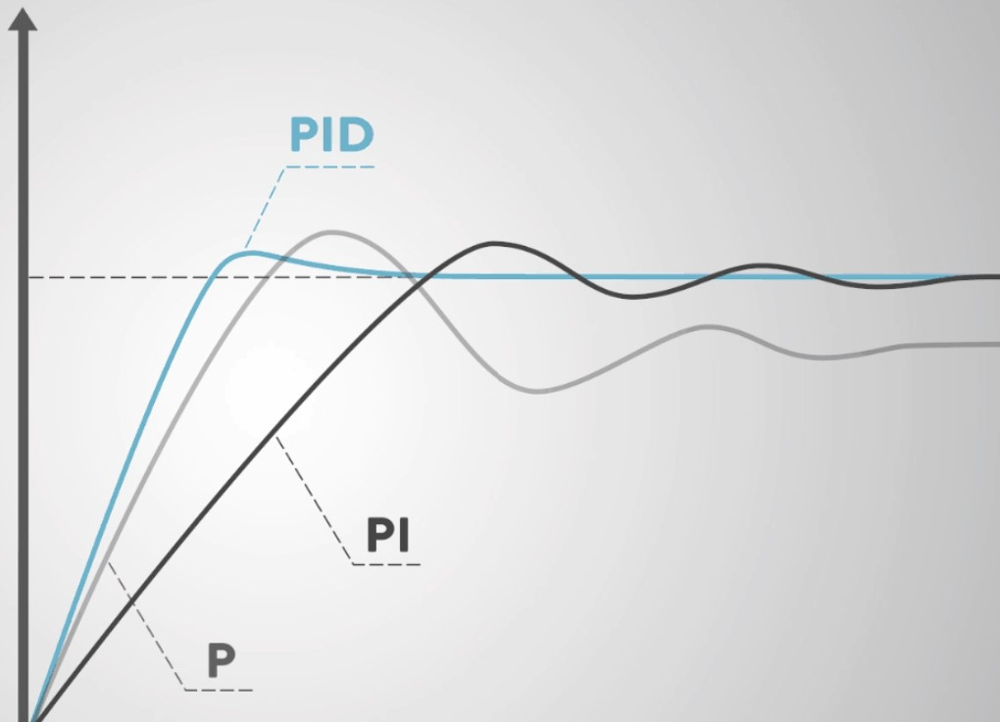

There's always more to learn!  As an expert, you now have the knowledge and tools to research and create new things on your own.  Maybe you've had an idea for how your robot could move more efficiently or maybe you would like to learn about Computer Aided Design.  There are endless possibilities so pick a topic that interests you and keep learning!    

<B>Ideas for additional learning:</B>

<TABLE>
<TR><TD>  Learn Lego CAD Studio 2.0 and use it to design your robot</TD><TD>There are free programs you can use to make a 3D model of your robot and create build instructions the look just like those you would get with a LEDO set.  An example CAD 3D model of a FLL robot and lego instructions created by Team 18300 Bolton Robotics students can be seen here <A HREF="https://fll-18300.github.io/home/">2023 Team 18300 BoxBot</A>
    
<A HREF="https://www.bricklink.com/v3/studio/download.page">Download Page for Lego CAD Studio 2.0</A>
</TD>
</TR>

<TR><TD> Create a new method and share it with other teams</TD><TD>Think about something that needs to be frequently done in robotics.  Rather than create new code every time you need to do this, make a method!   An example would be to design a method to call at the end of a mission, after driving home, that says “Yeah!  I just scored xx points!”, called by the method "shout_out(points)”.   Another example would be to create new drive methods that can turn while smoothly accelerating and decelerating like robot.straight()  Smooth acceleration can be a key to accurate and repeatable robot performance.
</TD>
</TR>

<TR><TD> Learn about the engineering process</TD><TD>Just like professional engineers, FLL students can use an interative process to design, create, test, and improve their robot.  Learn about this process, and use it throughout the FLL season. 
</TD>
</TR>

<TR><TD> Learn about different kinds of feedback loops</TD><TD>The Bolton Robotics line following module uses a simple proportional feedback loop.  Ever notice that sometimes the robot won't follow the line or may wiggle from side-to-side?  Learn more about how a proportional feedback loop works, what its limitations are, and then explore other better performing kinds of feedback loops.  There are many online tutorials, some even use the Lego Spike robot, do some research!   One better performing feedback loop is called "PID" which stands for Proportional, Integral, and Derivative.  Implement a PID or other type of better performing feedback loop as part of a line following or gyro drive method. 
</TD>
</TR>
</TABLE>
