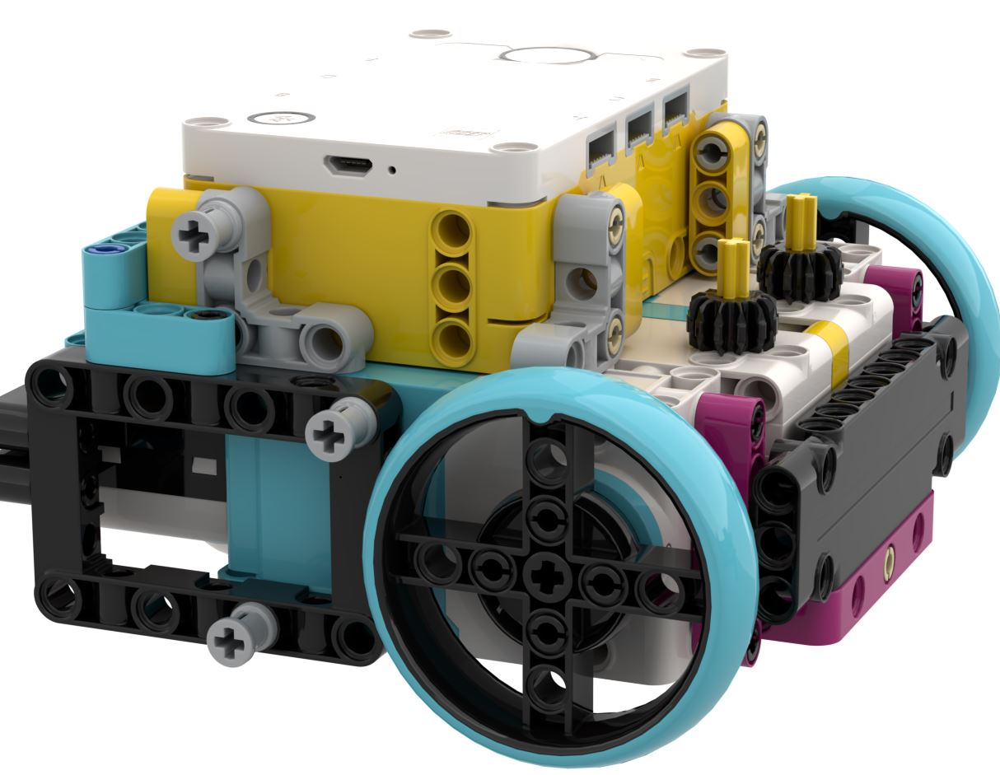
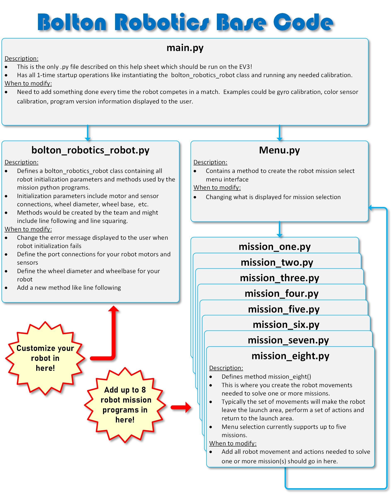

Bolton Robotics has been using Python to program Spike robots for FIRST Lego League, and it's made coding both powerful and approachable. Python is easy to learn, which means teams can focus on solving challenges instead of getting stuck on complicated code. It’s also great for debugging—finding and fixing mistakes quickly so your robot does what you want. Since Python is used by real engineers, you’re getting hands-on experience with a professional tool. It also makes teamwork and sharing code simple, so everyone can contribute and learn from each other. Whether you're building, coding, or collaborating, Python helps your team work smarter and go further.

# Gather what you need
Before you jump into the modules, make sure you have everything ready to go. These materials come from the Bolton Robotics Club, and here's what you'll need:

Lego Spike Robot: 
You’ll need a Spike robot with at least two medium motors and some wheels so it can move around and take on challenges.

Computer with Bluetooth and Internet Access: 
You'll need a computer (Windows or Chromebook) with Bluetooth and internet. This is where you'll write your code and connect to your robot using Pybricks.

# Training Modules
<TABLE>
<TR><TD> <A HREF="../spike_install/spike_install">Launch Lesson 1</A> </TD><TD><B>Getting Started</B> Installing all the apps.  You can skip this if you or a coach have already installed what's needed.  This step is usually handled by the Bolton Robotics Club Mentors.
</TD>
</TR>

<TR><TD> <A HREF="../spike_robot/spike_robot">Launch Lesson 2</A> </TD><TD><B>Build a Spike Robot</B> Build your own Spike Robot, You can skip this if you are using a pre-built robot.
</TD>
</TR>
  
<TR><TD> <A HREF="../spike_basecode/spike_basecode">Launch Lesson 3</A> </TD><TD><B>Pybricks and the Bolton Robotics Base Code</B> Learn the basics of the Pybricks IDE and the Bolton Robotics Base Code
</TD>
</TR>

<TR><TD> <A HREF="../Spike_customizing/Spike_customizing">Launch Lesson 4</A> </TD><TD><B>Customizing The Bolton Robotics Base Code</B> Your robot may be different than the Bolton Robotics BaseBot.  Learn what you might need to change and how to change it.
</TD>
</TR>

<TR><TD> <A HREF="../Spike_first/Spike_first">Launch Lesson 5</A> </TD><TD><B>Create your first program</B> Create your first program, download and run a program on the Spike robot.
</TD>
</TR>

<TR><TD> <A HREF="../../troubleshooting/troubleshooting">Launch Lesson 6</A> </TD><TD><B>Debugging Tips</B> What to do when it doesn't work
</TD>
</TR>

</TABLE>
