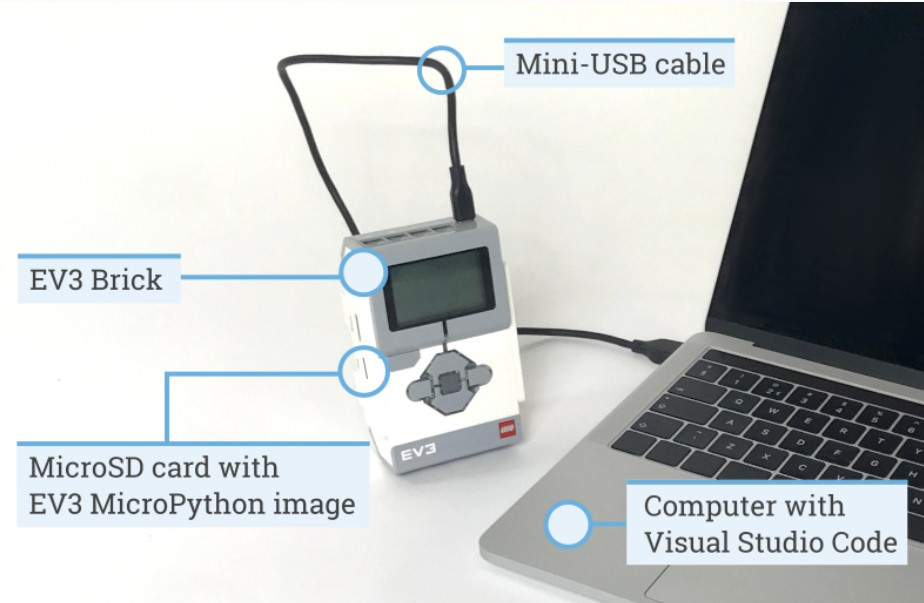

Bolton Robotics has been rocking First Lego League competitions with Spike robots using Python, and it's super awesome and easy! Here's the lowdown:

__Easy To Use Python:__ Python is like the superhero language for programming. It's super easy to use, which means you spend more time having fun and solving cool challenges with your robot instead of getting stuck in tricky coding stuff.

__Fixing Mistakes is a Breeze:__ Python makes fixing mistakes (aka debugging) a piece of cake. You can quickly figure out what's going wrong and make your robot do exactly what you want it to do. No more head-scratching!

__Teamwork Galore:__ Python is like the ultimate team player. You and your pals can work on different parts of the project at the same time without stepping on each other's toes. Teamwork makes the dream work, right?

__Sharing is Caring:__ With Python, it's super easy to share your awesome code with other teams. Imagine all the cool ideas bouncing around and making everyone's robots even cooler. Co-Opertition and sharing is caring, and Python makes it a breeze.

You are learning the same programming language as used by professional engineers! So, get ready to dive into the Python fun and take your Spike robot to new heights in your FIRST Lego League journey. It's going to be a blast!

# Gather what you need
Alright, future robotics champs! Before we dive into these awesome learning modules, let's make sure you've got everything you need. These materials are provided by the Bolton Robotics Club.  Here's your checklist:

 
Figure From <A HREF="https://pybricks.com/Spike-micropython/startinstall.html">Pybrics Documentation</A>

__Lego Spike Robot:__ Make sure you've got a Lego Spike robot ready to roll. It should have at least two medium motors and some cool wheels.

__Computer with Bluetooth Functionality and Internet Access:__ Fire up that computer of yours. We're about to embark on a coding adventure, so make sure it's ready and roaring to go.  Pybricks supports Windows computers and Chromebooks.

# Training Modules
<TABLE>
<TR><TD> <A HREF="../Spike_install/Spike_install">Launch Lesson 1</A> </TD><TD><B>Getting Started</B> Installing all the apps.  You can skip this if you or a coach have already installed what's needed.  This step is usually handled by the Bolton Robotics Club Mentors.
</TD>
</TR>
  
<TR><TD> <A HREF="../spike_basecode/spike_basecode">Launch Lesson 2</A> </TD><TD><B>Pybricks and the Bolton Robotics Base Code</B> Learn the basics of the Pybricks IDE and the Bolton Robotics Base Code
</TD>
</TR>

<TR><TD> <A HREF="../Spike_customizing/Spike_customizing">Launch Lesson 3</A> </TD><TD><B>Customizing The Bolton Robotics Base Code</B> Your robot may be different than the Bolton Robotics BaseBot.  Learn what you might need to change and how to change it.
</TD>
</TR>

<TR><TD> <A HREF="../Spike_first/Spike_first">Launch Lesson 4</A> </TD><TD><B>Create your first program</B> Create your first program, download and run a program on the Spike robot.
</TD>
</TR>

<TR><TD> <A HREF="../../troubleshooting/troubleshooting">Launch Lesson 5</A> </TD><TD><B>Debugging Tips</B> What to do when it doesn't work
</TD>
</TR>

</TABLE>
