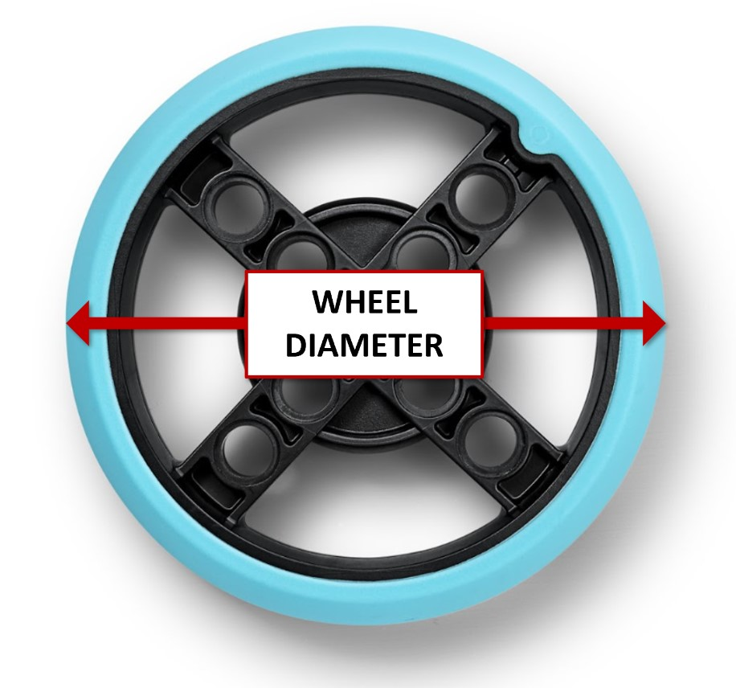
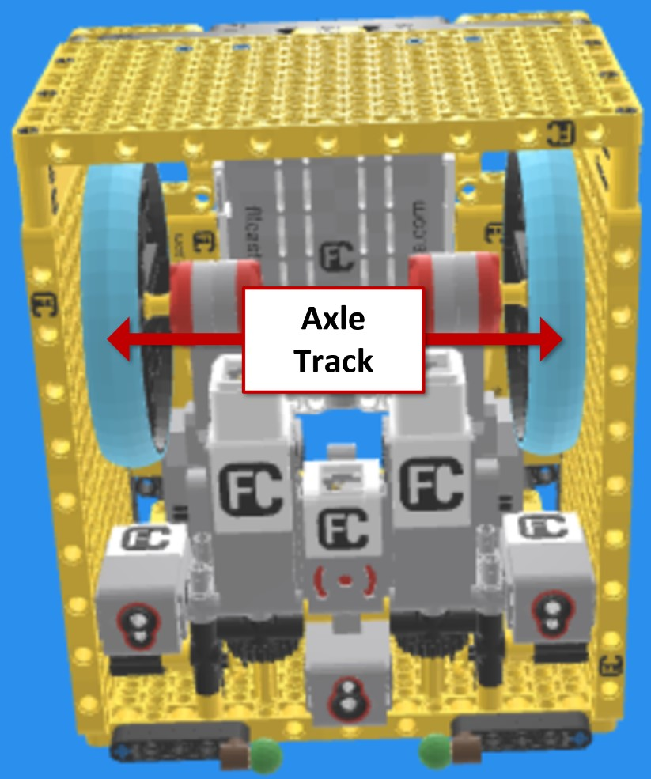

<BR><BR>
# What is a Python "class" and why use the Bolton Robotic's "robot" class?
When programming your FLL robot with Python, a class like Bolton Robotic's "robot" class works like a blueprint or template. It’s a way to describe your robot so the code knows things like what motors and sensors it has, how big the wheels are, and how far apart they’re spaced. Once you set this up, you can use that class to create a robot in your code that’s ready to move and react. The class also includes functions (called methods) that tell the robot how to do things like follow a line, square up to a line, or drive straight using the gyro. This setup helps keep your code organized and makes it easier to program your robot to do exactly what you want.

# What do I need to know about the Bolton Robotic's "robot" class?

A Lego Spike robot has dual use motor and sensor ports labelled A-F.  It is up to the robot designer <B>THAT'S YOU!</B> to decide how to use those ports.  The Bolton Robotic's "robot" class assumes a specific configuration of the robot which is described in the comments at the top of the file.  Consider this the 'default' configuration which must be altered as needed to match your robot.  Below is the robot configuration section from the robot.py python program.  The comments in the code explain the configuration so you can modify it as needed.

``` python
################################################################################
#### <--------------------- BEGIN ROBOT CONFIGURATION --------------------> ####
################################################################################

#############################################
# ROBOT DIAGRAM
############################################# 
# The base robot is required to have: 
#   2 drive motors
# The base robot may optionally have:
#   0-2 attachment motors
#   0-2 color sensors
#
# These are labelled in the diagram below. Your robot doesn't need 
# to follow this exact layout.  The goal is more to identify the drive and
# attachment motors and indicate whether they are on the left side or the right
# side of your robot.
#  When present on your robot, the following definitions are used:
# "LCS"  Left Color Sensor
# "RCS"  Right Color Sensor
# "LAM"  Left Attachment Motor
# "RAM"  Right Attachment Motor
# "LDM"  Left Drive Motor
# "RDM"  Right Drive Motor
#
#                   FRONT
#        ___________________________
# LEFT  |                           |   RIGHT
# SIDE  |                           |   SIDE
#       |   [ LCS ]       [ RCS ]   |   <-- Left and Right Color Sensors
#       |                           |
#       |   [ LAM ]       [ RAM ]   |   <-- Left and Right Attachment Motors
#   -   |                           |   -
#  | |  |___________________________|  | |
#  | |  |                           |  | |
#  | |==|===[ LDM ]       [ RDM ]===|==| |   <-- Left and Right Drive Motors
#  | |  |___________________________|  | |
#  | |                                 | |
#   -               BACK                -
#
#    <---------AXLE_TRACK (mm)--------->
#
#
#############################################
# Define Robot Parameters Here
#############################################
# Configuration parameters used by DriveBase.  
# Methods which use these parameters include:
#   r.robot.turn()
#   r.robot.straight()
#   r.robot.arc()
#   r.robot.drive()
TIRE_DIAMETER = 63  # mm
AXLE_TRACK = 86  # distance between the wheels, mm
STRAIGHT_SPEED = 400  # mm/sec
STRAIGHT_ACCEL = 300  # mm/sec^2
TURN_RATE = 300  # deg/sec
TURN_ACCEL = 200  # deg/sec^2
#############################################
# Define Robot Port Mappings
#############################################
# This needs to be setup accoring to how you
# wired your robot.  If you don't have color sensor(s) or
# attachment motor(s) you can comment them out.
PORT_MAPPING = {
    "ldm": Port.C,  # Left Drive Motor (Required)
    "rdm": Port.D,  # Right Drive Motor (Required)
    "lam": Port.F,  # Left Attachment Motor (Optional)
    "ram": Port.E,  # Right Attachment Motor (Optional)
    #"lcm": Port.A,  # Left Color Sensor (Optional)
    #"rcm": Port.B,  # Right Color Sensor (Optional)
}
#############################################
# Define Brain Orientation
#############################################
# Indicate which side of the brain faces the front of the robot.
#  
#
#               FRONT
#            
#          ------<->------
#         |      USB      |
#         | A           B |
#         |               |
#   LEFT  | C           D |  RIGHT
#         |               |
#         | E           F |
#         |               |
#         |     <-()->    |             
#          ---------------
#               BOTTOM
DISPLAY_ORIENTATION=Side.BOTTOM
#############################################
# Define Forward (Positive) Rotation For Each Motor
#############################################
# Define whether each motor's "forward" spinning direction
# is clockwise or counter-clockwise.  This is likely to be
# needed when drive or attatchment motors are installed inverted
# or upside down.  If your attachment motor is spinning in the wrong
# direction or if your robot spins in circles when you are trying to
# drive straight, you likely need to change one of these settings.abs
LDM_POSITIVE_DIRECTION=Direction.COUNTERCLOCKWISE
RDM_POSITIVE_DIRECTION=Direction.CLOCKWISE
LAM_POSITIVE_DIRECTION=Direction.CLOCKWISE
RAM_POSITIVE_DIRECTION=Direction.CLOCKWISE

################################################################################
#### <--------------------- END ROBOT CONFIGURATION --------------------> ####
################################################################################


```

__A Note on Wheel Size And Spacing__ <BR>
You control the robot by telling it how far to drive and how much to turn like this:
```python
# Drive Forward 10 centimeters
r.robot.straight(100)

# Turn right 90 degress
r.robot.turn(90)
```

But how does the robot know how far to go or how to turn right exactly 90 degrees?

It does this by keeping track of how much the motors turn and converts this into distance with a little bit of math.  In order for the robot to convert how much the motors turn into how far the robot drives you need to tell it how big the wheels are.  Bigger wheels will make the robot drive further for every rotation of the motor when compared to smaller wheels.
The robot uses the wheels diamter in millimeters as the measure of how big the wheels are.  You can measure your wheel diameter using a ruler or you may be able to find the diameter on the internet.  Remember, to get millimeters, measure in centimeters and then multiply by 10. 

<p  align="center"></P>

In order for the robot to determine how much to spin the motors to turn it also needs to know how far apart the center of the wheels are from each other.  The robot calls this the, "axle track."  You need to measure this on your robot using a ruler.

<p  align="center"></P>

After making the measurements, set the wheel diameter and axle_track for your robot design in the robot.py file by changing the following lines in robot.py to match your measurements:

```python
TIRE_DIAMETER = 63  # mm
AXLE_TRACK = 86  # distance between the wheels, mm
```

<p align="center">

<BR>
<B>Congratulations, you have completed the lesson!</B><BR>
<A HREF="https://fssfll.github.io/fssfll/spike/lessons/intermediate/">Return To Intermediate Lessons</A>
<BR>
 </P>
