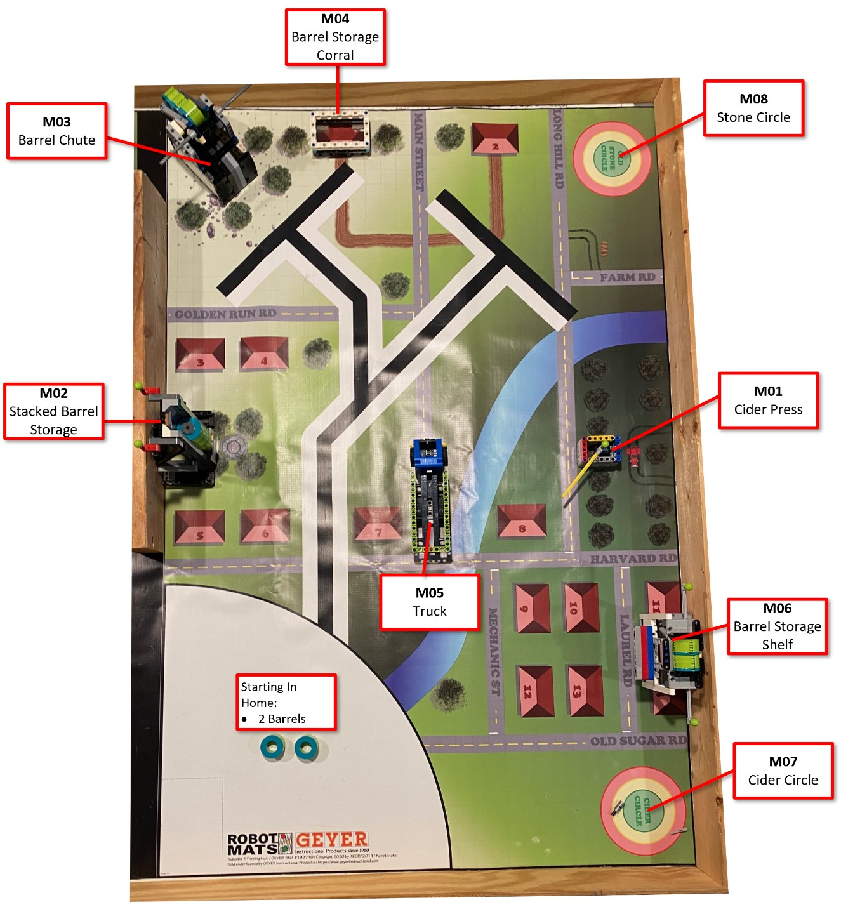

# Around Bolton Robot Game - Version 2.0!

After completing the python lessons it is now time for the  Bolton Robotics Around Bolton Robot Game!  For this game, the standard FLL table is divided into 3 identical smaller game areas.
All game areas have identical mission models, table setup, and scoring so students are free to choose any that may be available.

The game mat is shown below:

## Missions
There are 8 missions to solve with scoring conditions described in the scoring tool.  Remember to read the scoring conditions carefully!

[Bolton Robotics FLL Around Bolton Scoring Tool](https://fssfll.github.io/fssfll/spike/FLL-scorer/)

## Additional Rules
 * You can ony interact with mission models or cargo in the launch/home quarter circle
 * The robot, all its cargo and attachments must be within the launch/home quarter circle before starting a mission
 * The robot must start from and return home to the quarter circle
 * The challenges will be completed using a provided Lego robot basebot running MicroPython.    
 * Students will work in pairs using Pybricks IDE to create and debug their programs and program their robot. 
 * General FLL rules apply, ask a mentor if you have questions.
